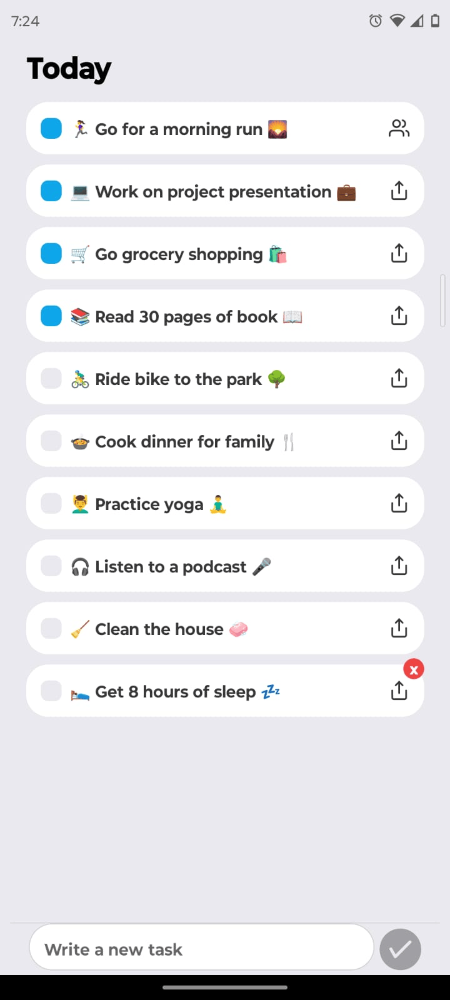
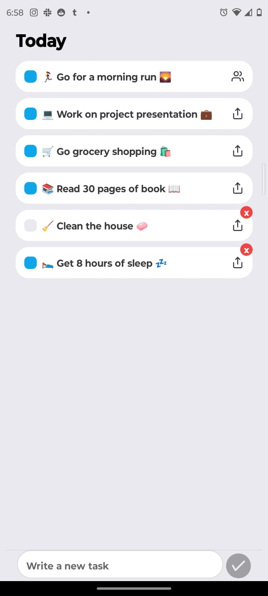

# App-ToDoList
Proyecto Full Stack con React Native, NodeJS, Express y MySQL.
Esta app permite crear una lista de tareas, en la cual se pueden crear tareas, marcarlas como realizadas, borrarlas y compartirlas con otros usuarios.
# Fotos de la App

# Agradecimiento
Quiero expresar mi gratitud a Alberto Moedano que con su canal de YouTube [**Code with Beto en Español**](https://www.youtube.com/@codewithbeto1) me enseñó cómo crear esta aplicación con Expo Go y React Native. Este tutorial ha sido inmensamente útil; siendo nueva en este framework, aprendo mucho con sus aportes. Gracias a todos los que se dedican a hacer este tipo de contenidos!. Espero prontamente hacer una app de mi propia invensión con este nuevo conocimiento.
